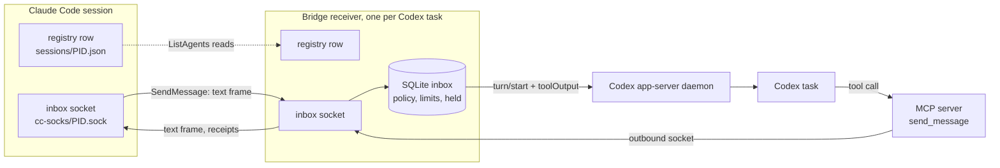

# Claude UDS Bridge

A Codex plugin that lets Codex tasks and Claude Code sessions message each other on one machine.

Claude Code lists and messages its other sessions through its own local registry. This plugin registers each Codex task in that registry, so Claude finds the task with `ListAgents` and writes to it with `SendMessage`. Claude needs no flags, plugins, or launchers. A bundled MCP server gives the Codex side `list_sessions` and `send_message`. Messages travel over Unix domain sockets in private per-user directories.

## Requirements

- Stock Codex with its shared local app-server daemon. CLI tasks on the daemon and desktop tasks it owns work. Older desktop tasks use the desktop IPC fallback. CLI sessions started with `--no-daemon` have no inbox. Real-runtime checks cover Codex 0.159.0, 0.159.2, and 0.159.3.
- macOS or Linux.
- Claude Code 2.1.224 or later, the first release with [cross-session messaging](https://code.claude.com/docs/en/cross-session-messaging).
- Bun on your `PATH`.

## Install

```bash
codex plugin marketplace add LeonKohli/claude-uds-bridge
codex plugin add claude-uds-bridge@leonkohli
```

To install from a local checkout, pass its path to `marketplace add` instead.

The plugin is not in the public Plugin Directory. As of 2026-10-03, OpenAI's [submission rules](https://developers.openai.com/plugins/deploy/submission) reject plugins with lifecycle hooks and accept only hosted HTTPS MCP servers. This plugin needs a `SessionStart` hook and a local MCP server, because the sockets and registry it uses live on your machine. It installs through its own marketplace until those rules change.

Codex ignores plugin hooks until you trust them. Open the plugin in Codex, review the two hooks, and confirm both. Then open a new task. Tasks that were already open keep running without the hooks.

A task registers when its `SessionStart` hook runs, which Codex does on the first turn. A fresh chat with nothing typed stays invisible to Claude. See [STARTUP.md](plugins/claude-uds-bridge/STARTUP.md).

## Check that it works

In the Codex task, ask for the bridge status. The `status` tool reports a `replyAddress` and a `transport` of `app-server` or `desktop`. A `null` address means the receiver is inactive. Check hook trust and the hook result.

In Claude Code, run `/list-agents`. The task appears as `codex-<directory>-<suffix>`. Ask Claude to message it.

## How a message arrives

A message steers the task's active turn, or starts a turn when the task is idle. A running tool is never interrupted. The bridge marks the text as peer input. It grants no approval, and the task's own permissions still apply.



The app-server transport uses `turn/start` with `toolOutput`, which starts or joins a turn at tool authority. The bridge reads existing settings and leaves approval requests to your UI. If the observer connection drops, status and permissions are `unknown` while the bridge reconnects for up to 30 seconds. If recovery fails, the receiver exits. A lost delivery acknowledgement stays `unknown` and is never resent.

`send_message` addresses a peer by `sessionId`, not by name. An ambiguous registration is refused.

## Control what arrives

The receive setting belongs to one task. When the permission modes of sender and receiver differ, a native dialog opens, also between turns. Held text reaches the model only after you release it.

| Setting | Behavior |
| --- | --- |
| `default` | Accept a matching permission mode, hold a differing one. Without a sender mode, accept only `prompting`. |
| `accept` | Accept everything and release held messages. |
| `hold` | Hold without expiry until an accepting setting applies or the session ends. |
| `refuse` | Drop messages and discard idle subscriptions. |

A message held by the mode comparison expires after 5 minutes. You set the expiry to `60s`, `5m`, `10m`, or `never` in the `inbox` dialog.

The sender sees Claude's status notices, among them `held`, `delivered`, `denied`, and `expired`. `delivered` means a held message was released. Ordinary acceptance sends no receipt. The `status` tool keeps Claude's explanation as `status_reason`.

## MCP tools

| Tool | Use |
| --- | --- |
| `list_sessions` | List local agents with ID, name, agent type, working directory, status, and start time. |
| `send_message` | Send text to one agent. Set `notify_when_idle` for one notice when that agent next goes idle. |
| `status` | Show the receiver and recent transport outcomes. |
| `inbox` | Open a dialog where you set the receive policy and hold expiry, or review the oldest held message. |

## Limits

- One message may reach 1,048,576 serialized characters. The sender refuses more before writing.
- A burst of 30 messages to one agent exhausts the budget. It refills one message every two seconds.
- At most 100 messages stay held and 50 accepted messages wait for Codex.
- `socket-written`, `accepted`, `started`, and `steered` report transport progress. A model reply is a separate event.
- Idle subscriptions fire once and last at most 12 hours.
- The bridge refuses attachments and says why. Send a shared path as text.
- The bridge does not lock files. Agree on file ownership before two agents edit one repository.
- App-server delivery uses the experimental `toolOutput` API. An incompatible runtime fails delivery; the bridge does not guess another protocol.
- Codex has no loaded-only subscription. A task that closes between the bridge's loaded check and `thread/resume` can be resumed by the observer. Reads and delivery never resume tasks.

What is missing compared with Claude Code is in [PROTOCOL-COVERAGE.md](plugins/claude-uds-bridge/PROTOCOL-COVERAGE.md). How other Codex and MCP bridges differ is in [COMPARISON.md](plugins/claude-uds-bridge/COMPARISON.md).

## Development

```bash
cd plugins/claude-uds-bridge
bun install --frozen-lockfile
bun run check
bun test
bun run build
bun run test:native
```

The plugin runs the bundled `dist/server.js` and `dist/hook.js`, and CI fails when they lag `src/`. Run `bun run build` after changing `src/`. Set a new `version` in `package.json` and `.codex-plugin/plugin.json` for every release, because Codex caches an installed plugin by version. `bun run test:native` starts the installed Codex binary in a temporary home with a local model stub. See [Testing](plugins/claude-uds-bridge/PROTOCOL-COVERAGE.md#testing) for its modes and environment variables.

## License

MIT. See [LICENSE](LICENSE).
