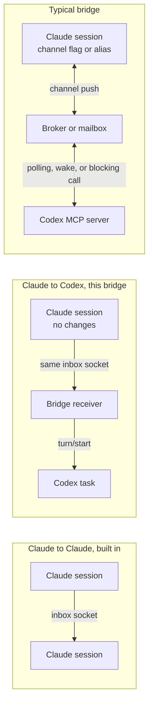

# Other Codex and MCP bridges

Several projects connect Claude Code and Codex sessions. This page compares them with the bridge on how they reach each agent. It is based on their READMEs as of 2026-10-03. They were read, not run.

## Difference in one line

Every project below adds its own transport: a broker, a mailbox, a spawned CLI, or a tmux paste. Most need something extra on the Claude side, such as a channel flag or a launcher alias. This bridge uses Claude's built-in local inbox. A stock `claude` session sees the Codex task in `ListAgents` and messages it with `SendMessage`. Claude's receiving rules (hold, refuse, approval dialogs, receipts) apply unchanged.

The top row is Claude's own path. The bridge keeps that path and adds a receiver on the Codex side, so Claude sees an ordinary peer. Most other bridges put a broker between both agents, and many change how Claude starts.

## How they reach each agent

| Project | Claude receives through | Codex receives through | Setup beyond installing |
| --- | --- | --- | --- |
| This bridge | Its own inbox socket | App-server `turn/start` with `toolOutput`, or desktop IPC | Trust the plugin hooks |
| [agent-peers-mcp](https://github.com/Co-Messi/agent-peers-mcp) | Channel notification, plus `check_messages` | Next tool call, or a bodyless wake turn under a managed app-server | Launch Claude with the `agentpeers` alias |
| [claude-peers-mcp fork](https://github.com/hinescreative/claude-peers-mcp) | Channel push from a broker | Polling with `check_messages` | Run a broker, optionally across machines |
| [codex-peers-mcp](https://github.com/jscianna/codex-peers-mcp) | Not applicable, Codex only | Polling with `check_messages` | Run a local broker |
| [oxtail](https://github.com/d4j3y2k/oxtail) | Hooks | Inbox read at a turn boundary, tmux wake | Install hooks, tmux |
| [cross-agent-teams-mcp](https://github.com/jtianling/cross-agent-teams-mcp/) | Channel proxy | App-server `--remote` launcher, or tmux paste | Run a daemon, start Codex through a launcher |
| [AgentBridge](https://github.com/bikeread/agent-bridge) | Channel notification | `turn/start` through an app-server proxy | Start both agents with `abg` |
| [claude-codex-mcp-bridge](https://github.com/WebisityStudio/claude-codex-mcp-bridge) | Blocking `bridge_wait` call | Blocking `bridge_wait` call | Both agents must keep a wait open |
| [codex-claude-bridge](https://github.com/abhishekgahlot2/codex-claude-bridge) | Channel notification | Blocking `send_to_claude` call, or polling | Claude needs `--dangerously-load-development-channels` |
| [team-mcp](https://github.com/DerekDardzinski/team-mcp) | `pull_messages` in a tmux pane | `pull_messages` in a tmux pane | Run every agent in tmux |
| [chat-across](https://github.com/VictorZhang01/chat-across) | Reads native session files | Reads native session files | Anchor each session to a named environment |
| [agent-bus](https://github.com/rishabhjava/agent-bus) | Headless `claude -p`, no live injection | Headless `codex exec`, no live injection | None |
| [agent-link-mcp](https://github.com/mikusnuz/agent-link-mcp), [acli-helper](https://github.com/kts982/acli-helper) | Spawned CLI | Spawned CLI | Install and log in to each CLI |

## What others have and this bridge lacks

- **Blocking ask.** `ask_peer` in oxtail and `send_to_claude` in codex-claude-bridge wait for the answer in one tool call. `send_message` returns after the transport step, and the answer arrives as a new turn.
- **Durable, acknowledged mailboxes.** agent-peers-mcp re-presents messages until the model acknowledges them. The bridge's inbox is durable on disk, but delivery to Codex is one-shot, and a lost confirmation stays `unknown`.
- **Delegation with an open obligation.** oxtail tracks `action_required` work until the receiver completes or blocks it.
- **Teams, broadcast, and roles.** cross-agent-teams-mcp and team-mcp address groups. The bridge addresses one agent at a time.
- **Discovery scopes and shared state.** The peers projects filter by repo or directory and publish a summary of current work. The bridge lists every local agent.
- **Reading a peer's transcript.** agent-bus, chat-across, and oxtail read another session's history. The bridge sends text only, as Claude's own messaging does.
- **Other agents and machines.** Gemini, Cursor, opencode, and cross-machine brokers appear in several projects. The bridge covers Claude and Codex on one machine.
- **Cockpit.** oxtail ships a tmux dashboard.

## What the bridge has and others lack

- No Claude-side setup, flags, or aliases, and no broker or daemon of its own.
- Codex receives through the shared app-server daemon that it already runs, so Codex starts as usual. An idle task starts a turn, and an active turn takes the text between tool calls.
- Claude's own inbound rules, receipts, loop guards, and rate limits apply, so a Claude-to-Codex message follows the same rules as a Claude-to-Claude message.

## Shared Codex limit

The live-messaging projects hit the same Codex boundary: an MCP server cannot start a turn on its own, so each polls, waits in a tool call, or goes through the app-server. None of the READMEs I read describes a chat that registers before its first turn. [STARTUP.md](STARTUP.md) explains why this bridge cannot either.

## Repository layout of other Codex plugins

The [Codex plugin documentation](https://developers.openai.com/codex/plugins/build) requires one file, `<plugin>/.codex-plugin/plugin.json`. Skills, `hooks/hooks.json`, `.mcp.json`, and assets sit at the plugin root. The marketplace file is `.agents/plugins/marketplace.json`. The docs suggest a `plugins/` folder and call it an example. They do not cover build steps, committed bundles, tests, or CI. Hooks need user trust after install, which matches this bridge.

The repositories below were fetched through the GitHub API on 2026-10-03. The table is a sample, not a survey.

| Repository | Plugin location | Components | How code ships | CI and tests |
| --- | --- | --- | --- | --- |
| [openai/plugins](https://github.com/openai/plugins) | `plugins/` | Skills, remote MCP | No code | None seen |
| [evo-hq/evo](https://github.com/evo-hq/evo) | `plugins/evo/`, with Claude and Kimi manifests beside the Codex one | Hooks, skills | `bin/` binary, npm | `ci.yml`, `publish.yml`, tests |
| [Canonry/canonry](https://github.com/Canonry/canonry) | `plugins/canonry/` | MCP, skills | Global npm binary | `ci.yml`, `publish.yml`, vitest |
| [thierryc/Glyphs-mcp](https://github.com/thierryc/Glyphs-mcp) | `plugins/glyphs-mcp/` | MCP, skills | Localhost HTTP server | Pages only |
| [douglasmonsky/codex-usage-tracker](https://github.com/douglasmonsky/codex-usage-tracker) | Repo root | MCP, skills | PyPI install | Several workflows, tests |
| [zapier/sdk](https://github.com/zapier/sdk) | Repo root | Skills | No code | `validate.yml` |
| This bridge | `plugins/claude-uds-bridge/` | Hooks, MCP | Committed `dist/` bundle | `ci.yml`, tests |

Shared by most of them:

- A marketplace entry with `source.path` of `./plugins/<name>` and the `AVAILABLE` and `ON_INSTALL` policy.
- A manifest `name` equal to the folder name, plus `version`, `author`, `license`, and an `interface` block.
- Skills as the main component, MCP second.
- A `.claude-plugin` folder next to `.codex-plugin` in five of eight sampled repos, so one repository serves both hosts.

Where this bridge differs:

- **Committed bundle.** None of the sampled Codex plugins commits a `dist/` folder. `codex plugin marketplace add` installs from the branch with no build step, so the bridge commits the bundle and CI fails when it lags `src/`.
- **Hooks and MCP, no skills.** The sampled repos mostly ship skills. This bridge ships none, because the work happens in a hook and a tool server.
- **Codex only.** The bridge has no `.claude-plugin` folder. Claude needs no plugin.

Codex caches an installed plugin under `~/.codex/plugins/cache/<marketplace>/<plugin>/<version>/`, keyed by the manifest `version`, from a read of the Codex source on `main`. A restart does not refresh the cache when only files changed. `codex plugin marketplace upgrade` reinstalls when the marketplace revision changed. Every release of the bridge therefore needs a new `version`.
